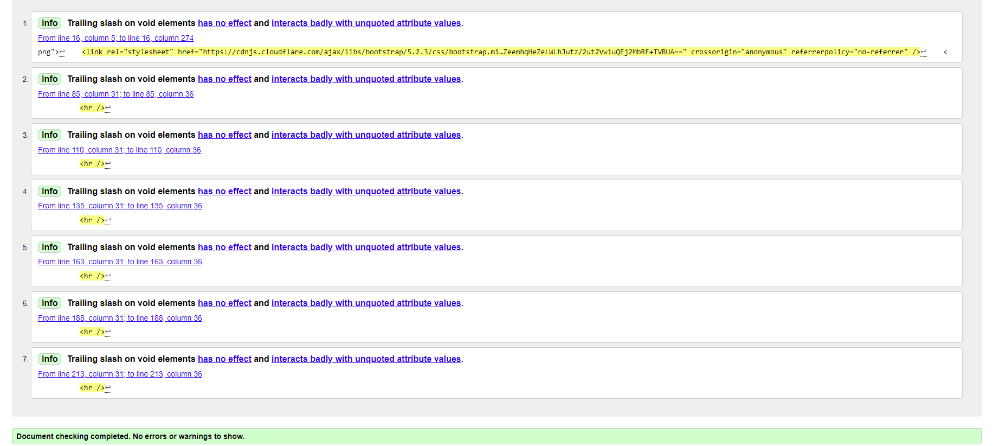

## BrainON

## About BrainOn
BrainOn is an innovative online learning portal designed to connect teachers and students through engaging video content.
The portal is designed for school students to learn the daily lessons in a more interactive way and make the learning journey
more fun.
The platform has features to come as it is going to develop in time. It is going to have a search and filter form as well as 
2 types of sign-in - one for teachers and one for students.

## Design
The design of the website is aimed to be interesting and easy to use for younger students. It is fully responsive so the
users can log in and study regardless of where they are. The main UX rules are kept such as readable text, and clear signs to find
and locate things on the page.

The logo has been designed by me, using CorelDraw.

## User stories

- The existing users can log in and watch online courses
- There is clear navigation on the website to use it easily
- The teachers who wish to share video lessons can send a collaboration request
- After each request/comment there is a clear message for the user
- For new users, the first page includes full information about the website
- For the new users there is clear guidance on how to sign up and why
- For admin, there is a designed UX to read requests, answer them
- For the admin, there is a chance to approve or disapprove the comments

### Future development

- Provide a filter to make it easy to find lessons
- Provide a search form to find a specific lesson or teacher's videos
- Have one shorter video(teaser) lesson for everyone who has not signed up yet to attract more users
- Provide actual videos instead of pictures
- Provide 2 sign-up methods for teachers and students
- Give teachers access to upload their videos

## Entity Relationship Diagram

To visualize the connections between the models in the BrainOn app, I have created a relationships diagram. This diagram provides a clear representation of how the models interact with each other.

## Models

The project and the models have been designed with the help of the Blog walkthrough project. 

- About model

- Course model

- Lesson model

- Comment model

## Designing The UI

Before diving into coding BrainON logo had been designed on CorelDraw and the UI on the Marvel App. During the development 
process some features had been removed and added to serve its purpose and to fit in the time frame.
The search feature has been removed at this stage of the project, Contact Us page has been moved to the About Page as a collaborate form.
In this stage, the colours have not been decided so it has been chosen grey as a neutral colour.

## Typography

The fonts chosen were 'Karla' for headings and 'Quicksand' for the rest of the app. As a fall back has been choosen standars 'serif' in case the choosen font does not load.
It has been used different font-weights and font-sizes to give clearity.

## Color Scheme

The app's color scheme primarily features black, white, gray, and subtle light shades. This minimalistic palette ensures the focus remains on the educational content, particularly the videos uploaded by the teachers.

However, the welcome page introduces a touch of color—soft and not overly bright. This page is designed to be inviting and visually engaging, using interactive elements and images rather than being text-heavy. This thoughtful design approach creates a warm and approachable entry point for users while maintaining the app's overall clean and professional aesthetic.

## Features

### Header

The header has been designed to navigate the students and the teachers easily through the website.
It is fully responsive and easy to use on all gadgets.

When the device is smaller the menu is moved to the side as a small burger button to save space.

### Home Page

The home page has been designed to give some information and motivate young learners to register and be a part of fun learning
experience.
It gives reasons why to sign up as it has been requested in user stories.
It is expected to extend this part of the project by adding a search and filter when the users are on the online lessons page.

### About Page

On the About page, the user gets to know about BrainON. It is more useful for the teachers who want to collaborate.
The short introduction leads the teachers to send an e-mail to the admin to share their videos.

### Collaboration form

The form comes just after About BrainON as a user would expect to find it quickly after reading about
the page and deciding to collaborate with BrainON.

### Online Lessons

Online lessons are available only for registered users. On the website, it shows only pictures. There is a short information 
including the name of the teacher, the subject and the name of the lesson as it is expected to have more than one teachers 
on one subject, some students might have favorite teachers and it is important to see the information before opening the
lesson. 
It is expected to develop in the future and have video lessons, and show a relevant picture on this page, however since this
project is only for learning purposes, no videos have been uploaded. There are only standard pictures to keep the website
interesting.

### Next/Prev Buttons

Next and Preview buttons appear as needed depending on which page the user is on and if there is a next or preview page.

### Comment Form

The comment form can be used only by registered users. The user can change or delete their comments.
When a user leaves a comment there is a clear message which pops up to inform the user that the comment is awaiting 
approval. After approval the user still can edit or delete the comment however the user can not see or edit someone 
else's comment.

### Register Form

The register form has been taken from Django's standard library. It has been styled and adapted to the design of the website.

### Log Out Form

Log out form, as a register form has been taken from Django's standard library. It has been styled and adapted to the 
design of the website.

### Footer

The footer includes the links to the social media and each page opens in a new window as a good UX.

### Admin Panel

The admin panel has access to see, and approve comments, to create a teacher profile and lessons.

From the admin panel, the user can see the requests and which ones are already read.

Admin can approve or delete the comments which are not appropriate.

## 404 page

The website has a custom 404 page which has been designed to lead the user back to the home page.

## Debugging

- Error has been shown while deploying the project.
- Added env.py file to fix it.

- Error has been shown when uploading the pictures from the admin panel.
- The error has been fixed by adding a Cloudinary link.

- Edit and delete buttons did not work properly.
- Fixed the bug by console logging. The ID of the comment was not being taken. Fixed the error.

### Unfixed Errors

- Uncought(in promise) Error

- Mixed content

## Manual Testing

The website has been tested on Google Chrome, Mozilla, and Google Edge on both bigger screens and mobile phones.
The content is loading on all web browsers.
Several manual tests have been done on both computer and mobile devices. 

- All the social media links are opening in a new tab
- All the buttons are reacting as it is expected
- It is possible to send a collaboration request

- It is not possible to send a collaboration request without e-mail, name or a message

- It is possible to register a new account on both mobile devices and computers
 The users Nare and JS have registered and left comments from mobile while asya
 has registered from a laptop

- It is possible to log in
- Logged-user can leave a comment
- Users can not see unapproved comments except for their own
- One user can not edit or delete another one's comment
- Edit comment/Delete comment buttons are working as expected

- Users can not leave an empty comment

- All the menu buttons are leading to the pages as expected
- Not authorized users can not see online lessons as expected
- Logged-user sees different buttons accordingly

- Admin gets collaboration requests as expected

- Admin can approve or delete comments

- Admin can create and delete a teacher/course profile

- Draft lessons don't show on the website
- By deleting a lesson, the comment deletes with the lesson
- By deleting a teacher all the lessons are deleted
- Log in and register pages check for valid passwords

## Validating Code

- Validating templates
Home page 

About page
- Error

- Validated

Online Lessons

Lesson details
- Error

- Validated

Log in
- Error

- Validated
Has changed the version of all auth

Register
- Error

- Validated
Has changed the version of all auth

Log out

All the CSS validation has passed through without any errors

About App has been validated without errors

Courses App has been validated without errors

The settings file has been validated without any errors

## Lighthouse

The website has been tested on Lighthouse to see the performance.

Before resizing the pictures: 

After resizing the pictures.

Mobile:

Computers:

## Deployment

The project was deployed to **Heroku**. The deployment process is as follows:

1. Create repository

- Create a new **GitHub** repository from CI template and  click on Create repository from template.
- Click 'Code' and then copy either the HTTPS or SSH link. I used SSH.

- Open GitPod and paste the URL then click open workspace

2. Installing Django and supporting libraries:

- Now it's time to install Django and it's supporting libraries. In the terminal, type the following commands:

        pip3 install Django~=4.2.1
        pip3 install dj_database_url psycopg2
        pip3 install dj3-cloudinary-storage

- After you have successfully installed the above, type the following command:

        pip3 freeze --local > requirements.txt

- This will create a requirements.txt file as show below

- Now we need to create our Django project and the applications. In the terminal type the following command:

        django-admin startproject PROJ_NAME .
        django-admin startapp APP_NAME .

- You then need to add your application to the INSTALLED_APPS section in your settings.py as shown below

- After creating models, type the following commands in the terminal:

        python manage.py makemigrations
        python manage.py migrate

3. Create the Heroku app:

- Navigate to your Heroku dashboard and create a new app with a unique name and choose your preferred region.

- Since we are in Heroku, navigate to your project settings and click 'Reveal Config Vars'. Add your Heroku config vars to your project as shown below

        DISABLE_COLLECTSTATIC = 1 is a temporary step for the moment and it will be removed before deployment

- Create a file named Procfile at the root directory of the project. In the Procfile, declare this is a web process followed by the command to execute your Django project.

        web: gunicorn poject_name.wsgi

- In settings.py file change DEBUG=True with DEBUG=False.

- Also, in settings.py we need to append the Heroku hostname to the ALLOWED_HOSTS list.

- Back in code, create a new file called env.py and ensure this is added to your gitignore file. Copy the below code but change the variable content to your specific details.

        import os

        os.environ["DATABASE_URL"] = "Your PostgreSQL link"
        os.environ["CLOUDINARY_URL"] = "Your PostgreSQL link"
        os.environ["SECRET_KEY"] = "Your PostgreSQL link"

- In settings.py, look for the line that says 'from pathlib import Path' and then insert the code below.

- Replace the default random security key that Django provides with your SECRET_KEY that you created in your env.py file.

- Now you can git add, commit and push changes.

4. Deploying an app to Heroku:

- Now, let's return to the Heroku dashboard, and in your app, click on the Deploy tab.

- In the Deployment method section enable GitHub integration by clicking on Connect to GitHub.

- Start typing your project repo name into the search box and click Search. A list of repositories from your GitHub account should appear. Click on the GitHub repo you want to deploy from.

- Scroll to the bottom of the page and click Deploy Branch to start a manual deployment of the main branch.

- Click on Open app to view your deployed project.

## Credits

The website has been made with the help of the Django Blog project. The About model, Collaboration models and Comment models
are taken from the blog project. JS file has been taken from the blog project and adapted to serve the BrainOn project.
Most of the help for planning the project has been taken from [Django Recipe Sharing tutorial by Dee Mc](https://www.youtube.com/watch?v=_GNvmwvvS70&list=PLXuTq6OsqZjbCSfiLNb2f1FOs8viArjWy&index=24).
Some help for coding has been taken from [Python Django tutorial](https://www.youtube.com/watch?v=kmeEIJE7JDU).

Designing the UI has been used Marvelapp.com
The pictures have been downloaded from the free source [Pixaby](https://pixabay.com/)
For resizing the pictures to shorten load time has been used [Imagesizer](https://imageresizer.com/)
For favicon has been used [Faicon Generator](https://favicon.io/favicon-converter/)
How to create 404 page [404 page in django](https://www.makeuseof.com/create-custom-404-error-page-django/)
